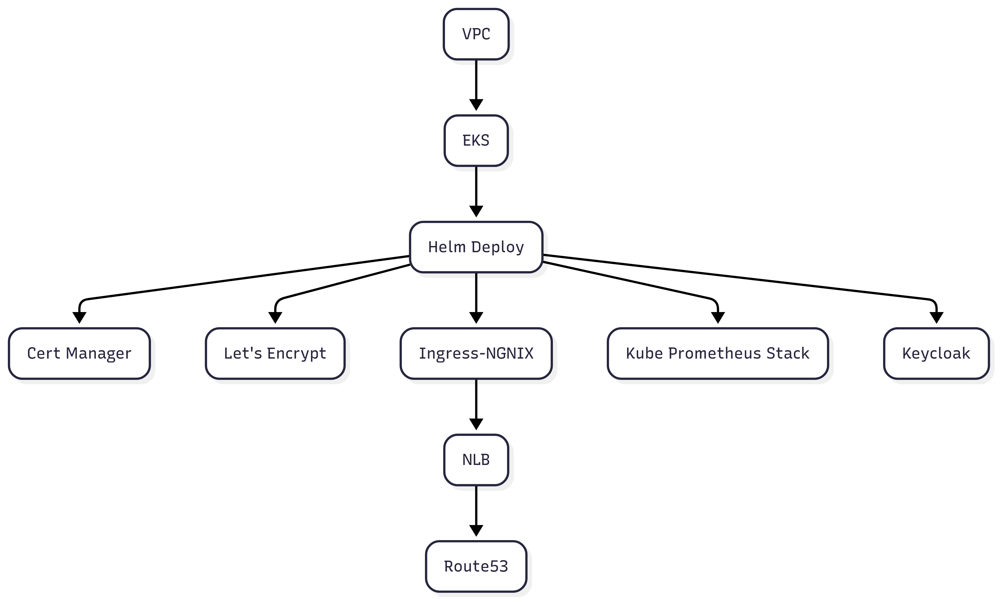
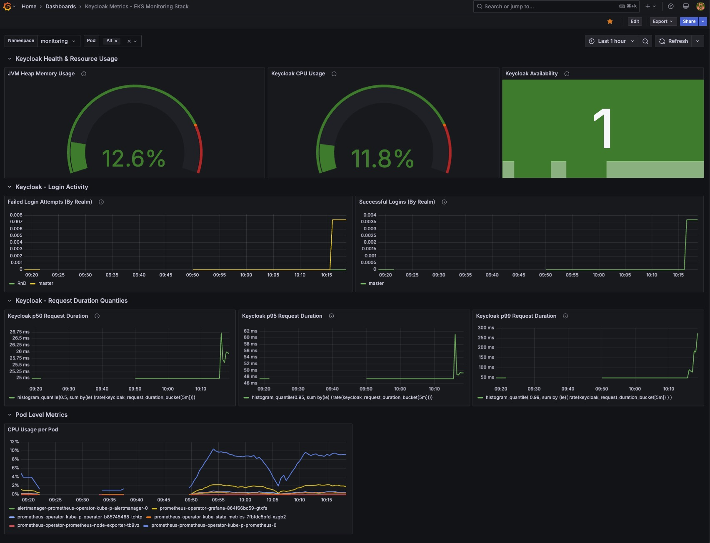
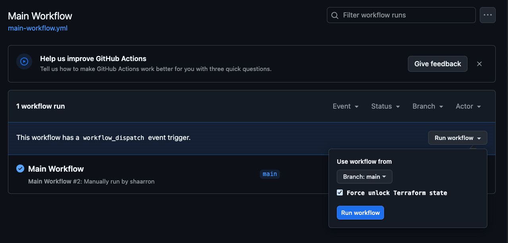

# EKS Monitoring Stack 

## Overview
This project demonstrates a fully automated CI/CD, web-accessible monitoring environment on AWS EKS, built with Terraform, Helm, and GitHub Actions, using:

- **Infrastructure as Code**
  - Provisioned using **Terraform**, including **VPC**, **EKS** cluster, and remote state backend with **S3** and **DynamoDB**.

- **CI/CD Automation**
  - Managed via **GitHub Actions**, enabling seamless workflows for provisioning, deployment, and teardown.

- **Application Deployment**
  - Services like **Keycloak**, **Prometheus**, and **Grafana** are installed using **Helm charts**.

- **Secure Access with Ingress**
  - **Ingress-NGINX** manages traffic routing.
  - **cert-manager** with **Let’s Encrypt** automatically provisions **TLS** certificates.

- **DNS Management**
  - **Route 53** is used to configure clean subdomains (e.g., `keycloak.domain.com`, `grafana.domain.com`).

- **One-Click Environment Deployment**
  - With a single workflow trigger, the entire stack infrastructure is deployed automatically.


## Table of Contents
* [Architecture](#Architecture)
    * [GitHub Actions](#github-actions)
    * [Terraform - AWS Resources](#terraform-provisioned-aws-resources)
    * [Helm-Based Deployments](#helm-based-deployments)
    * [Main Workflow Diagram ](#main-workflow-diagram)
    * [Repository Structure](#repository-structure)
* [Observability](#observability)
  * [Grafana - Keycloak Metrics Dashboard](#grafana---keycloak-metrics-dashboard)
* [Running the project](#running-the-project)
  * [Prerequisites](#Prerequisites)
  * [Running GitHub Actions](#running-github-actions)

## Architecture
### GitHub Actions
  - **Terraform State Bootstrap** - A prerequisite - Sets up the S3 bucket & DynamoDB table for Terraform state.
  - **Main Workflow** - Provisions EKS infrastructure and deploys the full stack end-to-end.
  - **Destroy All** - Tears down all provisioned resources, **use with caution, as it removes everything❗**
  - **Reusable - Terraform AWS setup** - Applies Terraform configurations for AWS resources based on a working directory.
  - **Reusable - Deploy to EKS** - Deploys services to an existing EKS cluster using Helm charts.

### Terraform-Provisioned AWS Resources

- **S3 Bucket**: Used as the backend for Terraform state.
- **DynamoDB Table**: Implements state locking to prevent concurrent Terraform executions.
- **EKS**: Hosts the Kubernetes control plane and worker nodes, where Keycloak, Prometheus and Grafana are deployed. Managed by AWS for automated upgrades, scaling and high availability.
- **VPC**: Three-AZ network with public subnets for NAT gateways & load balancer and private subnets for EKS nodes.
- **NLB**: Automatically provisioned by the Ingress-NGINX controller.
- **Route53**: Creates CNAME records that points to the NLB.

### Helm-Based Deployments

- **Keycloak** - Deployed using the official [**Bitnami**](https://github.com/bitnami/charts/tree/main/bitnami/keycloak) Helm chart.
- **Prometheus & Grafana** - Deployed using the **kube-prometheus-stack** Helm chart maintained by the [**prometheus-community**](https://prometheus-community.github.io/helm-charts), enabling full monitoring capabilities out-of-the-box.
- **Ingress NGINX Controller** - Deployed using the official **ingress-nginx** Helm chart maintained by the [**Kubernetes community**](https://kubernetes.github.io/ingress-nginx).
- **Cert-manager** - Deployed using the official Helm chart maintained by [**Jetstack**](https://cert-manager.io/docs/installation/helm/)
- **Let’s Encrypt ClusterIssuer** - Deployed using a custom Helm chart, built to support dynamic email injection from GitHub Actions — since no official chart exists for this resource.

### Main Workflow Diagram


### Repository Structure

```text
eks-monitoring-stack/
├── .github/
│   └── workflows/
│       ├── bootstrap-terraform-state.yml
│       ├── main-workflow.yml
│       ├── reusable-deploy-to-eks.yml
│       ├── reusable-terraform-aws-setup.yml
│       └── destroy-all.yml
│
├── helm/
│   ├── ingress-nginx/
│   │   └── values.yaml
│   ├── keycloak/
│   │   └── values.yaml
│   ├── kube-prometheus-stack/
│   │   └── values.yaml
│   └── letsencrypt-clusterissuer/
│       ├── Chart.yaml
│       ├── values.yaml
│       └── templates/
│
├── terraform/
│   ├── eks-infra/
│   │   ├── main.tf
│   │   └── variables.tf
│   ├── route53/
│   │   ├── main.tf
│   │   └── variables.tf
│   └── terraform-state/
│       ├── main.tf
│       └── variables.tf
│
├──  grafana-dashboards/
│    └── keycloak-metrics.json
│
└── README.md
```

## Observability

### Grafana - Keycloak Metrics Dashboard

This dashboard demonstrates a basic observability metrics of Keycloak.



### Dashboard Layout

- **Service Health**
  - **JVM Heap**: Memory usage
  - **CPU Usage**: Keycloak process load
  - **Availability**: `/metrics` scrape success

- **Login Activity**
  - **Failed Logins** (by realm)
  - **Successful Logins** (by realm)

- **Latency (ms)**
  - **p50**: typical response time
  - **p95**: 95% of responses complete faster than this duration
  - **p99**: 99% of responses complete faster than this duration

- **Pod Metrics**
  - **CPU per Pod**: cluster-wide pod CPU usage

## Running the project
### Prerequisites
#### 1. Required Secrets & Variables for GitHub Actions

The project requires an **IAM account** with specific [permissions](#2-required-iam-permissions) to deploy infrastructure and manage the Terraform state. The following secrets and variables must be set in the GitHub repository settings:

**Secrets:**

| Secret Name             | Description                                        |
|-------------------------|----------------------------------------------------|
| `AWS_ACCESS_KEY_ID`     | IAM access key for Terraform and CI/CD operations  |
| `AWS_SECRET_ACCESS_KEY` | IAM secret key for Terraform and CI/CD operations  |
| `LETSENCRYPT_EMAIL`     | Your personal/org email for certification purposes |


**Variables:**

| Variable Name             | Description                                                               |
|---------------------------|---------------------------------------------------------------------------|
| `AWS_REGION`              | AWS region where the infrastructure is deployed                           |
| `DOMAIN_NAME`   | Your domain name                                                          |
| `TF_STATE_BUCKET` | The name for your state bucket - *used to store the terraform state files |
| `EKS_CLUSTER_NAME`  | The name of your EKS cluster name                                         |

#### 2. Required IAM Permissions

The IAM user must have permissions to:
* **Create**, **Read**, **Write** and **Delete** the following resources:
  * S3
  * DynamoDB
  * EC2
  * VPC
  * EKS
  * Route53
  * Cloud Formation

### Running GitHub Actions
Once your secrets and variables are configured and your AWS user have the required IAM permissions,  
you should run the actions in the following order:
1. **Terraform State Bootstrap** - ****need to run only once*** 
2. **Main WorkFlow**

Once the Main Workflow completed successfully, expect the subdomains **keycloak**, **grafana**, **prom**(prometheus) to be availble.

* E.g `grafana.<domain>.com`

### force unlock terrraform state
To manually unlock the Terraform state in case it's stuck or locked by a previous run.

Enable the “Force unlock Terraform state” checkbox when re-running the workflow to release the lock and continue execution.  


